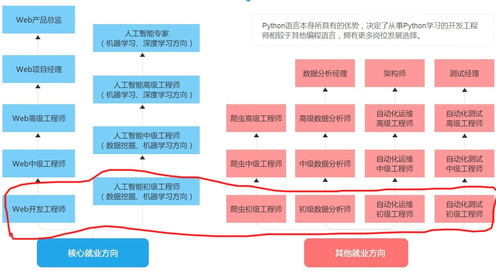
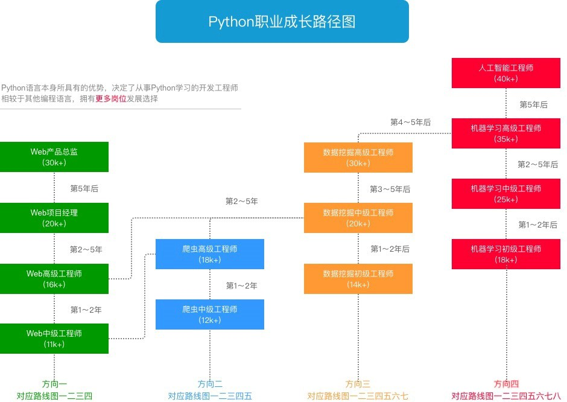
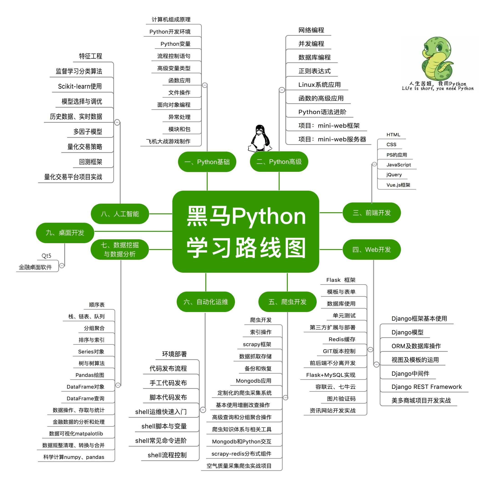
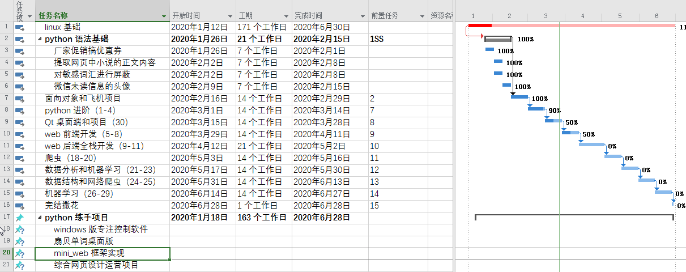

# 35K python 共学活动说明

## 学习 python 能做什么？

## 本学习项目整体周期规划

### 第一部分（1.12-2.2）

本课程开始是以 linux 作为基础操作系统的（真正的程序员不可能不熟悉 linux），但如果你没有任何编程基础和思维模式，刚开始就上手 linux 还是比较困难的，因此建议大家可以先在  windows 上学习 python，如果你是 mac 用户，如果熟悉 os X 这个系统的话，也会很方便开发。中间我会提供一个 linux 的虚拟机包，可以打开直接使用。

如果没有任何编程基础，linux 部分可以直接跳过，将主要精力放在 python 的学习上，我会提供一个 windows 下配置使用 python 的教程，整体教程虽然围绕 linux 展开的，但 python 基础部分还是可以跟上的，因为 python 目前的主流应用领域仍然是 web 开发，所以如果想要进一步学习 python，linux 仍然是绕不开的。

linux 跟 windows 类似属于一个计算机操作系统，不用觉得太过高大上，面向普通开发人员的 linux 一般只需要会简单操作即可，这边和学 windows 一样，只是简单地介绍了 linux 的常规操作（安装软件、移动复制粘贴等等），只是对于习惯了 windows 的用户来说，刚接触 linux 可能会有所不适应，另外 vim 的部分一定一定不要过分纠结，甚至可以先不用去学，vim 的配置使用本身就非常难，这边 用的 linux 版本是有图形界面的 的，可以用 gedit 等记事本工具替代 vim 暂时使用，本课程的主要目的还是学习 python 切勿本末倒置了。

### 第二部分（2.3-2.16）/ （1.12-2.16）

python 基础，这部分内容涉及到的比较多，如果写过 python 程序的，过得会比较快，如果没写过的话，需要重点学习，可以将学习第一部分的时间用来重点学习这部分的内容。正式周期是 2 周，对于不熟悉的人至少一个月时间，所以建议没有接触过 python 的，直接学习第二部分，别纠结在操作系统上了，要用的时候再学 linux。

### 第三部分（2.17-3.1）

python 面向对象编程和第一个有有实际意义项目案例，需要前面基础都打好才可以。飞机的项目中，视频只介绍了基本的功能，这个项目可以反复改，不断地扩充，最后甚至可以扩充成有关卡、得分和排名的一个常见的游戏。

### 第四部分（3.2-3.15）
python 高级编程技巧学习，这部分内容老师讲的非常精彩，深入浅出，很多原理性的东西，例如：装饰器、协程等都从源头进行了讲解。

### 第五部分（3.16-3.28）
Qt 项目练手，推荐使用 pyside2 这个 Qt 官方的 python 库，Qt 是个非常强大的 GUI 库，目前开发桌面端软件除了使用 C# 外，那些选择 C++ 的商业公司大都会选择用 Qt 库来开发，Qt 虽然在 windows 的主战场上未必有 .net 性能好和强大，但 Qt 可以兼容各个平台，linux 电脑端，嵌入式 arm 平台都可以使用。python 作为一个简单易学的语言，现在 Qt 官方也大力开发了 Qt 的 python 库（pyside2），因为简单易用，国外也有一些中小软件使用 python+Qt 的开发方式，例如：anki。

### 第六部分（3.29-4.11）
web 前段开发，这部分内容讲的比较实用，也很不错，从程序员的角度来理解前端的一些问题，**这段课程可能每个目录下播放顺序不对，需要自己查看。**

### 第七部分（4.12-5.2）
web 后端全栈开发

### 第八部分（5.3-5.16）
爬虫学习

### 第九阶段（5.17-5.30）
数据分析和机器学习基础

### 第十节段（5.31-6.13）
数据结构和网络爬虫深入学习

### 第十一阶段（6.14-6.27）
机器学习进阶学习

***

## 公告

*b 站的视频，随时可能会失效，昨天还分享的一个视频今天就已经失效了，抓紧时间学，网盘的视频有需要可以自行下载。*

周期 1-3 以 python 基础班这套教程为主：
https://www.bilibili.com/video/av82417875

链接：https://pan.baidu.com/s/1bRar9gQXmIgZSCWQkeGMnA （网盘压缩文件）
提取码：ft3e 
链接：https://space.bilibili.com/87977547 （某 UP 主上传的可在线观看的视频，包含网盘中的全部视频内容）

windows 下 python 学习教程参考：

链接 1：https://www.bilibili.com/video/av77465014

链接 2：https://www.bilibili.com/video/av55177217

链接 3：https://www.bilibili.com/video/av74106411  配套网址：http://www.python3.vip/

链接：https://pan.baidu.com/s/1E3x8bhCZ-cEdj21KAttFIg 
提取码：4w1r 

链接 1 这套教程老师讲的不错，涵盖了办公自动化的各种内容有兴趣精力也可以自学，另外如果不学习 linux 的同学可以先跟着这个课程熟悉下 windows 的环境和一些基础操作，这套视频的基础部分讲的比较少，主要是办公应用。

链接 2 是一套 windows 下的 python 基础教程，不学 linux 的可以跟学这套打基础，内容还是比较详尽和完整的。

建议： windows 下学习 python 的同学，可以先学习链接 1，大致了解 python 的语法功能还有一些应用不需要掌握，然后重新学习链接 2 或者链接 3 的内容，链接 2 和 3 任选一个即可。链接 2 是正规培训机构出的教程，内容详尽但可能冗余，链接 3 配有相关学习网站有文字加视频教程。

注意：所有的内容全部围绕了**主要链接 **这个内容展开的，其他都是辅助资料视频，学习笔记可以自己选择喜欢的教程，但学习进度和项目要求都根据**主要链接 **来的。这个学习项目会尽可能一直往前推进的，不会停下来等大家，大家要花更多地时间研究学习，尽量多写多做而不是只看视频。

***

## 推荐软件

链接：https://pan.baidu.com/s/1hcI8HIbF4fwalP5U_KXDIQ 
提取码：9q3t

- pycharm：python 开发算是最好的 IDE 了吧。
- chrome：后续需要学习 web 前端知识，chrome 有强大的调试功能。
- 欧陆字典：无广告，可扩展的单词库
- git：版本控制工具
- python 32 位和 64 位：32 位打包程序发布时兼容性好
- secureCRT：windows 下 ssh 远程登录工具
- Notepad++ ： windows 下小巧强悍的文本编辑器
- GeePlayer ： 爱奇艺万能播放器，和 potplayer、qqplayer 差不多
- anki：记忆工具，前期编程学习的知识点多，部分内容刚开始用的不多，可以做成卡片偶尔拿出来记忆下。
- virtualbox：最强的免费虚拟机软件
- tianruo ： 桌面截图工具
- everything ：windows 下最常用的文件搜索工具
- sysdiag ：火绒安全软件，类似 360 软件管家。

***

## 补充资料教程：

链接：https://www.bilibili.com/video/av21376839

建议学完再看，浓缩精简版的 CS 课程，虽然讲的不算深入，但浅出，基本上串联了计算机的必须学习的理论知识，可以作为进一步想要学习计算机科学的入门课程。虽然这门课时间不长不到 10h，很多内容讲的比较形象，但信息量大，涉及了 n 多门计算机理论课程，加上老师语速很快，如果对计算机没有一定了解的还是比较难看明白的，所以建议学完整个 python 课程，对计算机有一定认知和应用后再看这门课程，可以起到理论巩固实践的效果。